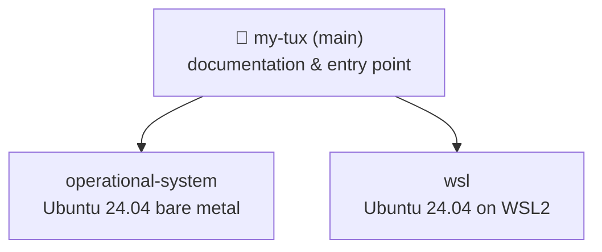

# My Tux

> Automated personal development environment setup for Ubuntu 24.04.


---



---

## Hardware

| | |
|---|---|
| CPU | AMD Ryzen 7 7700X |
| GPU | AMD RX 7800 XT (gfx1101, RDNA3) |
| OS | Ubuntu 24.04.3 LTS (Noble Numbat) |

---

## Quick Start

```bash
git clone https://github.com/rickelmedias/my-tux
cd my-tux

# choose your branch
git checkout operational-system   # bare metal
git checkout wsl                  # WSL2 on Windows

cp .env.example .env
nano .env
chmod +x bootstrap.sh scripts/*.sh
./bootstrap.sh
```

---

## License

MIT
